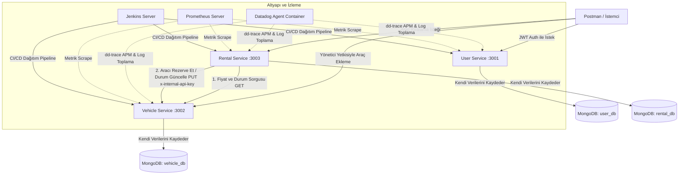

# MİKROSERVİS TABANLI ARAÇ KİRALAMA SİSTEMİ
## AKADEMİK PROJE DOKÜMANTASYONU VE TEKNİK RAPOR

---

### PROJE ÖZETİ
Bu proje; modern yazılım mimarilerinden **Mikroservis (Microservices) Mimarisi**, **Konteynerleştirme (Docker)**, **Sürekli Entegrasyon/Sürekli Dağıtım (CI/CD - Jenkins)** ve **Sistem Gözlemlenebilirliği (Observability - Datadog & Prometheus)** prensiplerini uygulamalı olarak gösteren uçtan uca (end-to-end) bir **Araç Kiralama Sistemi**dir.

Sistem; bağımsız ölçeklenebilir 3 mikroservisten, izole veritabanlarından ve DevOps otomasyon araçlarından oluşmaktadır. Projede kullanılan tüm teknolojiler endüstri standartlarında olup, modern bulut yerel (Cloud-Native) uygulama geliştirme standartlarına uygun olarak tasarlanmıştır.

---

## İÇİNDEKİLER
1. [Giriş ve Problem Tanımı](#1-giriş-ve-problem-tanımı)
2. [Sistem Mimarisi ve Tasarım Prensipleri](#2-sistem-mimarisi-ve-tasarım-prensipleri)
3. [Mikroservislerin Detaylı Analizi ve Veri Modelleri](#3-mikroservislerin-detaylı-analizi-ve-veri-modelleri)
   - 3.1. User Service (Kullanıcı Yönetim Servisi)
   - 3.2. Vehicle Service (Araç Yönetim Servisi)
   - 3.3. Rental Service (Kiralama Yönetim Servisi)
4. [Mikroservisler Arası İletişim Protokolü](#4-mikroservisler-arası-iletişim-protokolü)
5. [Altyapı ve DevOps Süreçleri (Docker & Jenkins Pipeline)](#5-altyapı-ve-devops-süreçleri-docker--jenkins-pipeline)
6. [Gözlemlenebilirlik ve İzleme Stack'i (Datadog APM & Prometheus)](#6-gözlemlenebilirlik-ve-izleme-stacki-datadog-apm--prometheus)
7. [API Test Senaryoları (Postman)](#7-api-test-senaryoları-postman)
8. [Akademik Değerlendirme ve Sonuç](#8-akademik-değerlendirme-ve-sonuç)

---

## 1. GİRİŞ VE PROBLEM TANIMI
Geleneksel monolitik (tek parça) yazılım mimarileri, proje büyüdükçe bakım zorluğu, tek hata noktası (Single Point of Failure), teknoloji bağımlılığı ve ölçekleme zorlukları gibi dezavantajlar yaratmaktadır. 

Bu projede, monolitik mimarinin getirdiği sınırlar aşılmış; **Araç Kiralama** iş süreçleri birbirlerinden bağımsız, kendi sorumluluk alanlarına odaklanmış (Single Responsibility) ve kendi veritabanlarını yöneten (Database-per-Service) mikroservislere bölünmüştür. 

**Projenin Temel Amaçları:**
*   Kullanıcı yetkilendirmesi ve profillerinin güvenli bir şekilde yönetilmesi.
*   Araç envanterinin dinamik olarak güncellenmesi ve takibi.
*   Servisler arası senkron HTTP API çağrıları ile kiralama işlemlerinin tutarlı yapılması.
*   Kodun Jenkins aracılığıyla otomatik test edilip dağıtılması.
*   Sistemin performans verilerinin ve loglarının merkezi olarak Datadog ve Prometheus ile izlenmesi.

---

## 2. SİSTEM MİMARİSİ VE TASARIM PRENSİPLERİ

Sistemin mimari tasarımı, servislerin birbirine gevşek bağlı (loosely coupled) olmasını hedefler. Aşağıdaki şemada sistem bileşenleri ve aralarındaki etkileşim gösterilmektedir:



### Temel Mimari Prensipler:
1.  **Database-per-Service Pattern:** Her mikroservis sadece kendi MongoDB veritabanına erişebilir. `user-service` yalnızca `user_db`'ye, `vehicle-service` yalnızca `vehicle_db`'ye ve `rental-service` yalnızca `rental_db`'ye yazıp okuyabilir. Servislerin birbirlerinin veritabanlarına doğrudan SQL/NoSQL sorgusu atması engellenmiştir.
2.  **Stateless Services:** Servisler tamamen durumsuzdur (stateless). Kullanıcı oturum bilgileri sunucuda tutulmaz, istemci tarafından gönderilen **JSON Web Token (JWT)** ile anlık olarak doğrulanır. Bu durum, servislerin arkasına yük dengeleyici (Load Balancer) konularak yatayda sınırsız ölçeklenmesini sağlar.
3.  **CI/CD Pipeline As Code:** Dağıtım adımları manuel değil, sürüm kontrol sisteminde (`Jenkinsfile`) kod olarak tanımlanmıştır.

---

## 3. MİKROSERVİSLERİN DETAYLI ANALİZİ VE VERİ MODELLERİ

### 3.1. User Service (Kullanıcı Yönetim Servisi)
Kullanıcıların sisteme kaydolmasını, giriş yapmasını ve yetkilendirilmesini (Role-Based Access Control) sağlayan servistir. `Port: 3001` üzerinde hizmet verir.

*   **Teknolojik Seçimler:** Node.js, Express, Mongoose, JWT, BcryptJS.
*   **Güvenlik:** Kullanıcı şifreleri veritabanına düz metin olarak kaydedilmez. `bcryptjs` kütüphanesi kullanılarak 10 tuzlama (salt) turu ile hash'lenir. Giriş yapıldığında 1 saat geçerliliği olan, kullanıcının `userId` ve `role` bilgilerini içeren imzalı bir JWT token üretilir.

#### Veri Şeması (User Schema):
```javascript
const userSchema = new mongoose.Schema({
  email: {
    type: String,
    required: true,
    unique: true,
    trim: true,
    lowercase: true
  },
  password: {
    type: String,
    required: true
  },
  role: {
    type: String,
    enum: ['user', 'admin'],
    default: 'user'
  }
}, { timestamps: true });
```

#### API Uç Noktaları (Endpoints):
*   `POST /api/auth/register` : Yeni kullanıcı kaydı. `role` parametresi belirtilerek `admin` veya standart `user` oluşturulabilir.
*   `POST /api/auth/login` : Kullanıcı girişi. Başarılı ise JWT döner.
*   `GET /api/auth/profile` : Token sahibi kullanıcının profil bilgilerini getirir (Şifresiz). `authMiddleware` korumalıdır.
*   `GET /api/auth/users` : Sistemdeki tüm kullanıcıları listeler. Yalnızca `role: admin` olan kullanıcılar erişebilir.

---

### 3.2. Vehicle Service (Araç Yönetim Servisi)
Filodaki araç envanterinin kaydını tutan ve durumlarını yöneten servistir. `Port: 3002` üzerinde çalışır.

*   **Güvenlik Katmanları:** 
    *   **Admin Koruması:** Yeni bir araç ekleme işlemi sadece `role: admin` olan kullanıcıların JWT token'ı ile yapılabilir.
    *   **Internal API Key Koruması:** Bir aracın müsaitlik durumunu (`isAvailable`) kiralama işlemi sırasında güncelleme yetkisi sadece iç servisler arası iletişime aittir. Dışarıdan yetkisiz kullanıcıların bu durumu değiştirmemesi için HTTP Header üzerinden `x-internal-api-key` kontrolü yapılır.

#### Veri Şeması (Vehicle Schema):
```javascript
const vehicleSchema = new mongoose.Schema({
  plateNumber: { type: String, required: true, unique: true }, // Plaka
  brand: { type: String, required: true },                     // Marka (örn: Renault)
  model: { type: String, required: true },                     // Model (örn: Megane)
  year: { type: Number, required: true },                      // Yıl
  dailyPrice: { type: Number, required: true },                // Günlük Kiralama Bedeli
  isAvailable: { type: Boolean, default: true }                // Rezervasyon Durumu
}, { timestamps: true });
```

#### API Uç Noktaları (Endpoints):
*   `POST /api/vehicles` : Envantere yeni araç ekler (Admin & JWT korumalı).
*   `GET /api/vehicles/available` : Sistemdeki kiralama durumuna uygun (`isAvailable: true`) olan araçları listeler.
*   `GET /api/vehicles/:id` : Belirtilen ID'ye sahip aracın tüm detaylarını döner.
*   `PUT /api/vehicles/:id/status` : Aracın kiralama durumunu günceller (`isAvailable: true/false`). Sadece geçerli `x-internal-api-key` header'ı ile tetiklenebilir.

---

### 3.3. Rental Service (Kiralama Yönetim Servisi)
İş mantığının (Business Logic) en yoğun olduğu servistir. Kullanıcıların araçları belirli tarihler arasında kiralamasını sağlar. `Port: 3003` üzerinde çalışır.

*   **Fiyat Hesaplama Mantığı:** Kiralama başlangıç (`startDate`) ve bitiş (`endDate`) tarihleri arasındaki milisaniye farkı hesaplanarak gün sayısına çevrilir. En az 1 gün kabul edilecek şekilde, gün sayısı araç servisinden dinamik olarak çekilen günlük fiyat (`dailyPrice`) ile çarpılarak `totalPrice` hesaplanır.
*   **İş Akışı Tutarlılığı (Consistency):** Kiralama kaydı oluşturulduktan hemen sonra, ilgili aracın başkası tarafından kiralanmasını engellemek için `vehicle-service`'e HTTP PUT isteği gönderilerek aracın `isAvailable` değeri `false` yapılır.

#### Veri Şeması (Rental Schema):
```javascript
const rentalSchema = new mongoose.Schema({
  userId: { type: String, required: true },    // User Service'ten JWT ile gelen ID
  vehicleId: { type: String, required: true }, // Seçilen aracın ID'si
  startDate: { type: Date, required: true },
  endDate: { type: Date, required: true },
  totalPrice: { type: Number, required: true },
  status: { 
    type: String, 
    enum: ['active', 'completed', 'cancelled'], 
    default: 'active' 
  }
}, { timestamps: true });
```

#### API Uç Noktaları (Endpoints):
*   `POST /api/rentals` : Araç kiralama işlemini başlatır. (JWT Korumalı).
*   `GET /api/rentals/my-rentals` : Giriş yapan kullanıcının geçmiş ve aktif tüm kiralama kayıtlarını listeler.

---

## 4. MİKROSERVİSLER ARASI İLETİŞİM PROTOKOLÜ

Mikroservis mimarilerinde servislerin birbiriyle konuşması kritik bir konudur. Bu projede **Senkron HTTP İletişim Modeli** tercih edilmiş ve **Axios** kütüphanesi kullanılmıştır.

Bir müşteri araç kiralama isteği gönderdiğinde gerçekleşen senaryo şu şekildedir:

1.  **İstemci (Müşteri)**, `rental-service`'e `vehicleId`, `startDate` ve `endDate` parametreleriyle istek atar. İsteğin header kısmına JWT Token eklenmiştir.
2.  `rental-service` JWT token'ı doğrular ve kullanıcının `userId` bilgisini çıkarır.
3.  `rental-service`, `vehicle-service`'e senkron bir **HTTP GET** isteği atarak (`http://vehicle-service:3002/api/vehicles/<id>`) aracın veritabanındaki güncel durumunu sorgular.
4.  Gelen yanıta göre araç var mı ve `isAvailable === true` mu kontrol edilir. Müsait değilse kiralama iptal edilir ve `400 Bad Request` dönülür.
5.  Müsait ise toplam tutar hesaplanarak kiralama kaydı `rental_db`'ye kaydedilir.
6.  `rental-service`, `vehicle-service`'e **HTTP PUT** isteği göndererek (`http://vehicle-service:3002/api/vehicles/<id>/status`) aracın durumunu `isAvailable: false` yapar. Bu istek atılırken yetkisiz kişilerin araç durumunu değiştirmemesi için sistem çevresel değişkenlerinde tanımlanmış olan `INTERNAL_API_KEY` bilgisi `x-internal-api-key` header'ı ile gönderilir.

Bu model sayesinde servisler arası tam entegrasyon ve veri tutarlılığı sağlanmış olur.

---

## 5. ALTYAPI VE DEVOPS SÜREÇLERİ (DOCKER & JENKINS PIPELINE)

### 5.1. Docker ve Çoklu Konteyner Yapısı (Multi-Container Orchestration)
Tüm servisler ve bağımlılıklar platformdan bağımsız çalışabilmesi için Docker ile paketlenmiştir. Projenin kök dizinindeki `docker-compose.yml` dosyası, tüm orkestrasyonu tek bir komutla ayağa kaldıracak şekilde yapılandırılmıştır.

*   **Mongo Servisi:** Tek bir MongoDB imajı (`mongo:7`) ayağa kaldırılır. `user_db`, `vehicle_db` ve `rental_db` veritabanları bu tek sunucu üzerinde birbirlerinden izole mantıksal şemalar olarak tutulur. `mongo_data` volume'ü sayesinde konteyner silinse bile veriler kaybolmaz (Data Persistence).
*   **Port Yapılandırması:** 
    *   MongoDB: `27017`
    *   User Service: `3001`
    *   Vehicle Service: `3002`
    *   Rental Service: `3003`
    *   Jenkins: `8080` ve `50000` (Agent iletişimi için)

### 5.2. Jenkins CI/CD Boru Hattı (Pipeline As Code)
Süreçlerin otomatikleştirilmesi için `Dockerfile.jenkins` ile özel bir Jenkins imajı tanımlanmıştır. Bu imaja Jenkins'in kendi içinden ana makinedeki docker motorunu kontrol edebilmesi için `docker.io` ve `docker-compose` kurulmuştur.

`Jenkinsfile` içinde tanımlı sürekli entegrasyon adımları şunlardır:

```groovy
pipeline {
    agent any

    stages {
        stage('Checkout') {
            steps {
                checkout scm // Sürüm kontrolünden (Git) kodun çekilmesi
            }
        }

        stage('Docker Sürüm Kontrolü') {
            steps {
                sh 'docker --version'
                sh 'docker-compose --version'
            }
        }

        stage('Mikroservisleri Derle (Build)') {
            steps {
                sh 'docker-compose build' // Dockerfile'lardan yeni imajların derlenmesi
            }
        }

        stage('Canlıya Al (Deploy)') {
            steps {
                // Mikroservislerin, MongoDB'nin ve Datadog ajanının arka planda canlıya alınması
                sh 'docker-compose -p microserviceproject up -d user-service vehicle-service rental-service mongo datadog-agent'
                echo 'Sistem ve Datadog Ajanı güncellendi! 🚀'
            }
        }
    }

    post {
        success {
            echo 'Harika! Build ve Deploy başarıyla tamamlandı.'
        }
        failure {
            echo 'Hata! Jenkinsfile içinde veya süreçte bir sorun var.'
        }
    }
}
```

Bu boru hattı sayesinde geliştirici kodu Git'e gönderdiğinde, Jenkins değişikliği algılar, imajları yeniden derler ve sıfır kesinti (Zero Downtime) hedefiyle yeni sürümü otomatik olarak docker üzerinde devreye alır.

---

## 6. GÖZLEMLENEBİLİRLİK VE İZLEME STACK'I (OBSERVABILITY)

Mikroservis sistemlerinde dağıtık yapının izlenmesi, hataların hangi serviste olduğunun tespiti (root-cause analysis) monolitik uygulamalara göre çok daha zordur. Bu projede bu sorunu çözmek adına iki devasa izleme aracı entegre edilmiştir.

### 6.1. Datadog APM (Application Performance Monitoring) & Log Yönetimi
Her mikroservisin giriş noktasına (`index.js` 1. satır) Datadog'un APM kütüphanesi entegre edilmiştir:
```javascript
const tracer = require('dd-trace').init();
```
Bu kütüphane sayesinde servislerin aldığı HTTP istekleri, veritabanı sorguları ve servisler arası Axios çağrıları otomatik olarak izlenir (distributed tracing).

`docker-compose.yml` üzerinde tanımlı olan `datadog-agent` servisi, Docker soketini (`/var/run/docker.sock`) dinleyerek:
*   Konteynerlerin CPU, Bellek ve Ağ kullanımlarını toplar.
*   Servislerin ürettiği konsol loglarını otomatik yakalar (`DD_LOGS_ENABLED=true`).
*   Servislerin birbirleri arasındaki çağrı gecikmelerini (Latency), hata oranlarını ve throughput değerlerini Datadog bulut paneline (US5) aktarır.

### 6.2. Prometheus Metrik Toplama (Metrics Scrape)
Sistem kaynaklarının ve servis sağlığının açık standartlarda izlenmesi amacıyla Prometheus konfigürasyonu (`prometheus.yml`) projeye eklenmiştir:

```yaml
global:
  scrape_interval: 15s # Her 15 saniyede bir metrikleri topla

scrape_configs:
  - job_name: 'microservices'
    static_configs:
      - targets: ['user-service:3001', 'vehicle-service:3002', 'rental-service:3003']
```
Prometheus, tanımlanan bu hedefleri düzenli olarak tarayarak sistemin çalışma süresi (uptime), istek sayıları ve bellek tüketimi gibi zaman serisi metrik verilerini toplar.

---

## 7. API TEST SENARYOLARI (POSTMAN)

Sistemin uçtan uca doğrulanması için hazırlanan `CarRental-Postman.json` koleksiyonu, gerçek bir kiralama senaryosunu simüle eder. Test adımları ve testlerin doğrulanma mantığı şöyledir:

1.  **Kullanıcı Kaydı (Register - POST):**
    *   URL: `http://localhost:3001/api/auth/register`
    *   Gövde (Body): `admin@test.com` e-postası ve `admin` rolü ile kayıt gerçekleştirilir.
2.  **Kullanıcı Girişi (Login - POST):**
    *   URL: `http://localhost:3001/api/auth/login`
    *   **Postman Test Scripti:** Giriş başarılı olduğunda dönen JWT Token'ı otomatik olarak yakalar ve global `jwt_token` değişkenine yazar.
3.  **Yeni Araç Ekleme (Vehicle Add - POST):**
    *   URL: `http://localhost:3002/api/vehicles`
    *   Header: `Authorization: Bearer {{jwt_token}}`
    *   Gövde (Body): Renault Megane (Plaka: 34ABC123, Günlük: 750 TL) verisi gönderilir.
    *   **Postman Test Scripti:** Oluşan yeni aracın benzersiz `_id` değerini yakalar ve global `vehicle_id` değişkenine kaydeder.
4.  **Müsait Araçları Listeleme (GET):**
    *   URL: `http://localhost:3002/api/vehicles/available`
    *   Sistemdeki kiralanabilir araçları listeler (Eklediğimiz araç burada listelenir).
5.  **Araç Kiralama (Rental - POST):**
    *   URL: `http://localhost:3003/api/rentals`
    *   Header: `Authorization: Bearer {{jwt_token}}`
    *   Gövde: Dinamik `{{vehicle_id}}` parametresi ve `2026-06-01` ile `2026-06-05` tarih aralığı (4 gün) ile kiralama başlatılır.
    *   **Sonuç:** Sistem 4 gün üzerinden toplam `4 * 750 = 3000 TL` fiyat hesaplar ve kiralama kaydını oluşturur. `vehicle-service`'e istek atarak aracı kirada durumuna sokar.
6.  **Kullanıcı Kiralama Geçmişi (GET):**
    *   URL: `http://localhost:3003/api/rentals/my-rentals`
    *   Kullanıcının yaptığı 3000 TL'lik kiralama kaydını başarıyla gösterir.
7.  **Durum Kontrolü (GET):**
    *   URL: `http://localhost:3002/api/vehicles/available`
    *   Tekrar çağrıldığında, kiralanan aracın listede artık **gözükmediği** doğrulanır. Bu durum servisler arası senkron iletişimin kusursuz çalıştığını kanıtlar.

---

## 8. AKADEMİK DEĞERLENDİRME VE SONUÇ

Bu proje kapsamında gerçekleştirilen çalışmalar, modern bulut mimarilerinde karşılaşılan pek overwhelmed mimari ve operasyonel problemi çözüme kavuşturmuştur:

*   **Dağıtık Veri Yönetimi:** "Database-per-Service" yaklaşımı ile servislerin veritabanı düzeyinde birbirine bağımlı olması engellenmiş, veri güvenliği ve mikroservis bağımsızlığı maksimize edilmiştir.
*   **Servisler Arası Güvenli İletişim:** İç haberleşmede `x-internal-api-key` kontrolü kullanılarak, hassas veri güncellemelerinin (örneğin araç durumunun değiştirilmesi) sadece yetkili servislerden yapılması garanti altına alınmıştır.
*   **Bulut Entegrasyonuna Uygunluk:** Tüm servislerin Dockerize edilmesi ve Jenkins ile otomatikleştirilmesi, uygulamanın AWS, Azure, Google Cloud veya Kubernetes (K8s) gibi modern bulut platformlarına taşınmasını son derece kolaylaştırmaktadır.
*   **İzlenebilirlik Standartları:** APM ve log toplama altyapısı sayesinde dağıtık sistemlerde hata ayıklama süresi minimuma indirilmiş ve üretim (production) ortamı standartlarında bir izleme mekanizması kurulmuştur.

**Özetle;** bu çalışma, bir araç kiralama senaryosu üzerinden yola çıkarak; yazılım mühendisliği tasarımı, sistem güvenliği, DevOps pratikleri ve gözlemlenebilirlik metodolojilerini başarıyla bir araya getiren kapsamlı bir akademik projedir.
